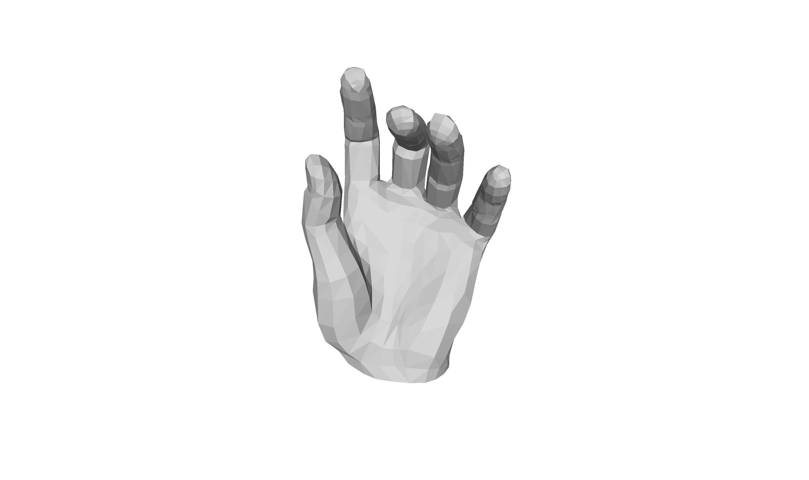

# MANO-Hand

Numpy an TensorFlow implementation of MPI MANO hand model.

# Usage

1. Download official model and use `dump_model.py` to pre-process it.
2. Run `mano_np.py` and you'll get the following mesh.

[Here](https://youtu.be/x47qnL3GOfE) is a video of all the scans in the dataset.
